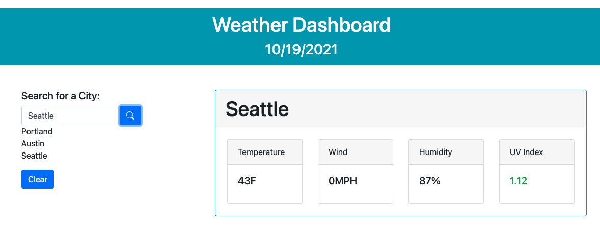

# Weather Dashboard

## Description 

Weather app to fetch and display the current and forecasted weather by city name. Displays the current temperature in F, wind MPH, humidity percentage, and UV index of searched city. Also displays a list of recently searched cities. This data is gathered from the [OpenWeatherMap](https://openweathermap.org/) API.

## Table of Contents
* [Links](#links)
* [Technologies](#technologies)
* [Usage](#usage)
* [Screenshots](#screenshots)
* [Demo](#demo)

## Links 

* [LiveLink](https://stephanieheins.github.io/WeatherDashboard/)
* Local: See [Usage](#Usage) for local setup instructions.

## Technologies

* HTML
* CSS/Bootstrap
* Javascript
* OpenWeatherMap API

## Usage 

* Clone the repository 
* Open index.html in a browser 
* Search for a city

## Screenshots

